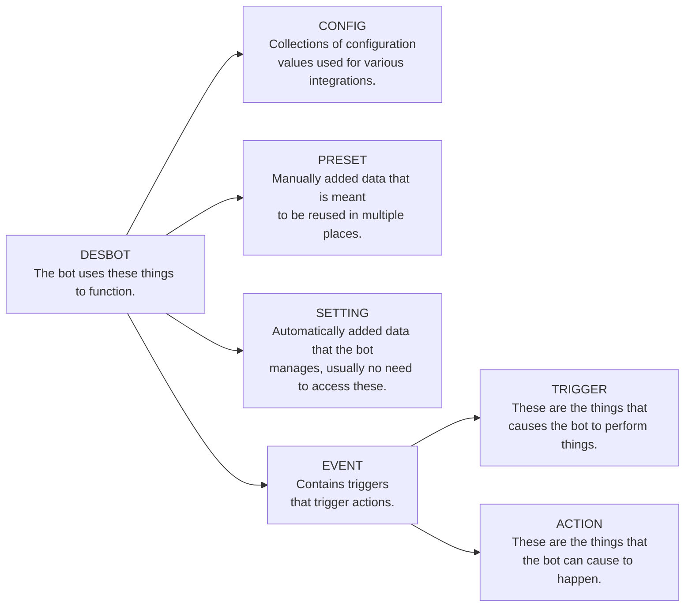
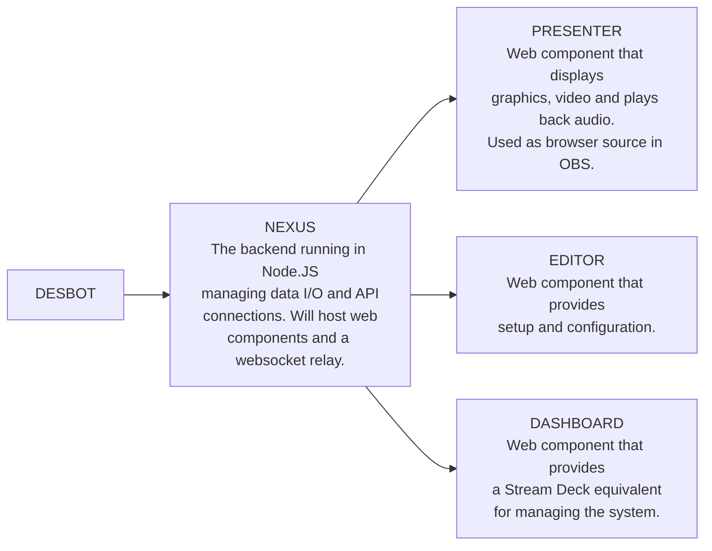

# desbot [alpha]
The bot is currently in alpha, that means not all features are here, but it is possible to run. Expect large changes to still occur.

## What does it do?

### The Project
Desbot is a streaming bot for Twitch, it runs as a browser-source in your streaming software, it can connect to various APIs and services, play back media and show on screen graphics.  

### Capabilities
The bot is meant to be a nexus for your stream interactions, it can connect to a range of services and APIs, and it can be extended with custom scripts. Expand the section below for a high level overview of what it can do.

1. Create, manage and listen for Twitch rewards, toggle them on/off depending on a range of conditions, update their settings.
2. Listen to commands from Twitch chat, write to Twitch chat and act on whispers.
3. Post messages and embeds in Discord channels via webhooks.
4. Speak text using Google TTS, read out chat, reward messages, status messages, announcements, support for users to change their own voice. 
   * Comes with a lot of support functions like name cleanup, text cleanup, custom nicks, word to audio replacement, a dictionary for word replacement.
5. Connect to a range of accessory tools: to change SteamVR settings, capture SteamVR screenshots, detect running SteamVR games, send overlays into SteamVR, and more.
6. Connect to OBS Studio using the 4.x Websocket plugin, to show/hide sources and filters, trigger screenshot capture.
7. Write text labels to disk, as well as a range of settings for various functions.
8. Send key presses to arbitrary applications using PHP to execute an AutoIT v3 component.
9. Can pipe screenshots from both SteamVR and OBS to overlays and/or Discord.
10. Can trigger custom URIs for applications, or load a URL in the background to trigger standard webhooks.
11. Load and post Steam game info & achievements to Twitch chat & Discord.
12. Update the Twitch category from the currently running Steam game automatically.

---

## How to use it?
This section will explain how to get started with the bot, how to install it, how to configure it, and how to use it. Expand the sections below as you go.

### Installation

#### Mandatory things
1. You need to have at least one user account on [Twitch][twitch] as that is needed to get through the setup.
2. A webserver with PHP 8.1 or higher, an easy ready-made solution is [XAMPP][xampp].
   * Inside `php.ini` in `xampp/php` uncomment this line: `extension=sqlite3` by removing the leading `;` to enable the SQLite3 plugin. Then restart Apache.
3. To compile TypeScript you need [Node.JS][nodejs].
   * With Node installed, install the TypeScript compiler with `npm install -g tsc` in the terminal.

#### Good to Have things
1. A secondary [Twitch][twitch] account to use as a bot in chat, so it doesn't look like you are writing all automated messages yourself.
2. [Git][git] installed, possibly with a GUI client, so you can clone the repository and easily pull down new changes, it is also used to name backup archives when using the included backup script.
   * Make sure you can access it in your terminal, run `git version` in the terminal and see if it succeeds, if not it needs to be added to the `PATH` environmental variable. 
3. An API key from [Google][googletts], so you get access to TTS functionality, which is a commonly used feature in the bot.

#### Get the bot
1. Clone this repository to a folder in the document root of your webserver, go to it in the terminal and run `git clone https://github.com/BOLL7708/desbot.git`. If you are using `XAMPP` the root is `xampp/htdocs`.
2. Run `tsc` in the terminal to compile the project, it should return empty if there are no issues.
3. Open the URL to the bot in your browser and go through the setup, see the next section for configuration, the URL should look something like this if you used the defaults: `http://localhost/desbot/`

### Configuration

1. The first time you run the main page it will create a new database. Click the link at the bottom to continue to the editor.
2. You are now in the initial setup, which includes signing in with Twitch for both your channel and an second account to act as a bot in chat, which can be your main account or a secondary account specifically made for this.
3. After the setup you have access to the main interface, here it is recommended to go to the `🍰 Defaults` section to import default presets and events, this will help you get a very solid base setup and includes things are not well documented so hard to get any other way.
4. Go to  `🎨 Config > Speech > Google Api Key`, and insert your API key if you have one, this to get TTS throughout.
5. Use the `🧰 Tools` section of the editor to perform things like importing existing Twitch rewards, load data for Twitch users, load data for Steam games, connect to a Philips Hue hub, and more.
   * If you have existing rewards on Twitch, it is a good idea to use the import tools in here. Keep in mind that if you want the bot to be able to update and toggle your reward, they need to be created by the bot. You can still import existing rewards, delete them, and then have this bot create them from the imported presets.  

### Updating

To update the project you should pull down the latest changes and then recompile the project, follow these steps:
1. Go to the project root in the terminal, this will be in `xampp/htdocs/desbot` if you used the defaults.
2. Use Git to pull the latest changes from the `master` branch, if you haven't checked out a different branch you can run this in the terminal to get the update: `git pull`
3. Still in the same terminal, run `tsc` to recompile the project, it should return empty if there are no issues.

That should be it. Go to the path of the bot in your browser and check the version number in the top left corner under the logo, it should be the latest version as seen on GitHub or the website.

---

## Tools & links
### Applications
Links to various tools and resources.

#### Things that should or might already be installed
* [XAMPP][xampp] - Used to run the bot locally, as the backend is currently relying on PHP.
* [Git][git] - Used to clone the repository and to check which commit the project is on to name backups.
* [Node.JS][nodejs] - Used to compile TypeScript to JavaScript.
* [Open Broadcaster Software][obs] - Streaming software, used to run the bot as a browser source.

#### Things that are optional accessories that can be used with the bot 
* [AutoIT v3][autoit] - Used to send key presses to arbitrary applications.
* [DB Browser for SQLite][sqlite] - SQLite database browser, useful for inspecting the database.
* [OpenVR2WS][openvr2ws] - Used to connect to SteamVR to leech data from it and remotely change settings.
* [OpenVROverlayPipe][pipe] - Used to launch overlay graphics and notifications in SteamVR.
* [SuperScreenShotterVR][sssvr] - Used to capture screenshots from SteamVR and pipe them to overlays and/or Discord.

### Official Links

* [Website][website] - The official website for the bot, contains a lot of information as well as this very ReadMe.
* [Discord][discord] - The official Discord server for the bot, where you can get support and chat with other users.
* [Reddit][reddit] - The official subreddit for the bot.
* [Bluesky][bluesky] - The official Bluesky page for the bot.
* [Twitter][twitter] - The official Twitter account for the bot.

---

## Development
Information about how the application is build and functions, as well as future plans.

### Data Structure
This describes the various data structure that is used to manage and configure the bot.

There are a range of data sources used by the events, triggers and actions. These are descibed below.

Events are the main way to configure the bot to act on specific triggers to perform a range of actions. The root element is as mentioned the event, then you assign the triggers and actions to it, and the constitutes the entire thing.

### Roadmap
The items below are both major conversions and new features. These are things that are going to happen at some point, most things are already sketched out and planned.

1. The DB conversion took 16 months, but it's done, it's on here as there is some polish to do before continuing to the next thing.
2. Convert the backend of the project to Node.JS, this has a number of benefits.
   * NPM libraries for Twitch, Discord, etc. This will offload the API integration maintenance which will help a lot.
   * Node instead of Apache for HTTP serving, this will remove one installation to run the bot.
   * Node instead of PHP for page rendering and DB access, this will make for a more stable connection to SQLite.
   * Node to host a Websocket relay server, instead of relying on a separate application.
   * Node can run some browser APIs that can be offloaded from the browser component.
   * Node can be run on Windows, Mac, Linux and can thus likely run 24/7 on a Raspberry Pi.
3. Presenter - Break out the presentation part into a separate component. This will come automatically with the Node.JS conversion, but could be looked at beforehand. Basically all media playback and on screen overlays will be a separately hosted webpage that gets data over Websockets from the backend.
4. Dashboard - Create a Stream Deck equivalent as a webpage, where reward and system features can be toggled or triggered. This is where the old game reward profile feature will come back as we can persist reward states for the running Steam game.

### Planned Final Bot Structure
This has been the plan for a while, the whole conversion from config files to database with an editor has taken a while, so we're still a bit from splitting up the project and convert it to Node.JS.

[twitch]: https://twitch.tv

[xampp]: https://www.apachefriends.org/download.html
[git]: https://git-scm.com/downloads
[nodejs]: https://nodejs.org/en/download
[googletts]: https://cloud.google.com/text-to-speech/docs/before-you-begin

[obs]: https://obsproject.com/download
[sqlite]: https://sqlitebrowser.org/dl
[autoit]: https://www.autoitscript.com/site/autoit/downloads
[openvr2ws]: https://github.com/BOLL7708/OpenVR2WS
[pipe]: https://github.com/BOLL7708/OpenVROverlayPipe
[sssvr]: https://github.com/BOLL7708/SuperScreenShotterVR

[website]: https://desbot.app
[discord]: https://desbot.app/discord
[reddit]: https://desbot.app/reddit
[twitter]: https://desbot.app/twitter
[bluesky]: https://desbot.app/bluesky
[trello]: https://desbot.app/trello
